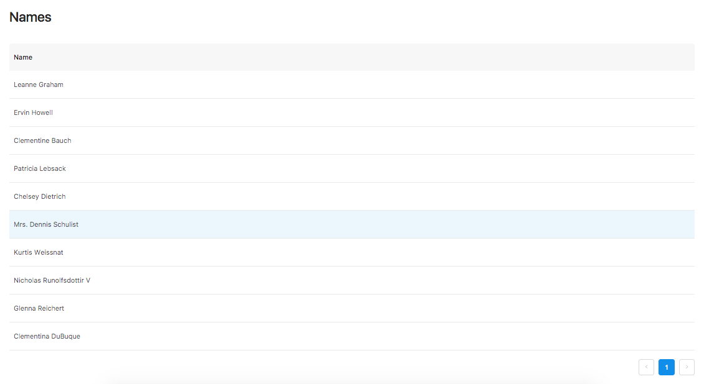

# AJAX request in React 📩 

## AXIOS

* Library -> [Here](http://codeheaven.io/how-to-use-axios-as-your-http-client/)
* `npm i axios`

## API

* Fake Online REST API for Testing and Prototyping -> [Here](https://jsonplaceholder.typicode.com/)

## Tutorial 

* Ajax request in react -> [Here](https://daveceddia.com/ajax-requests-in-react/)

## Result 

